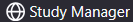
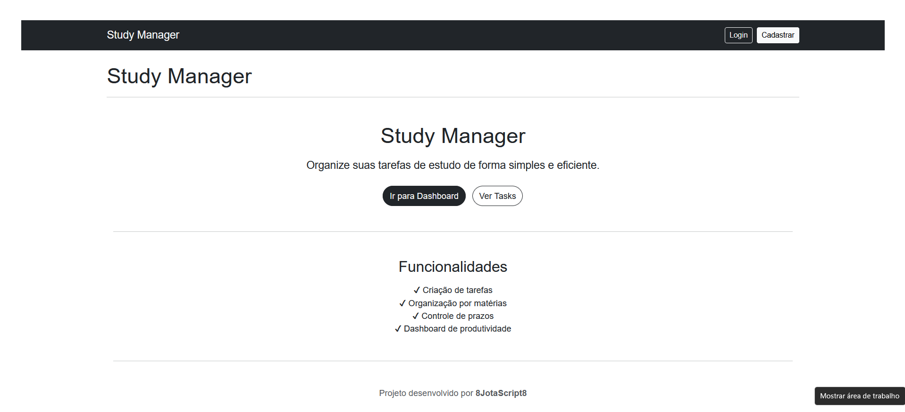
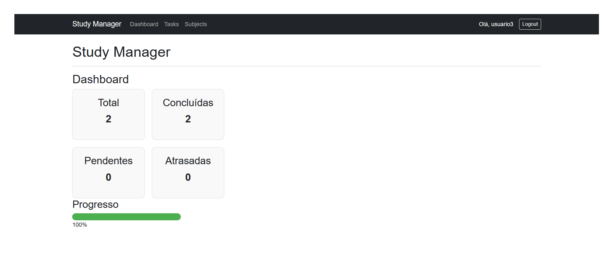
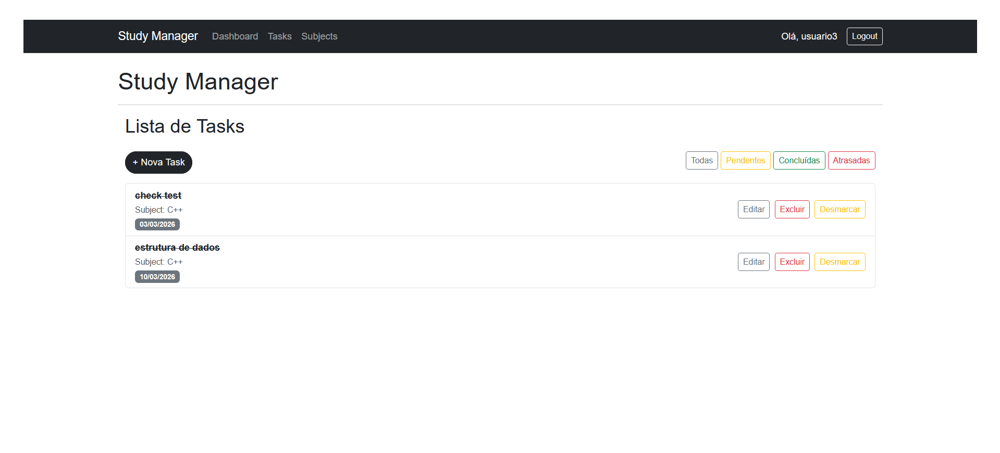
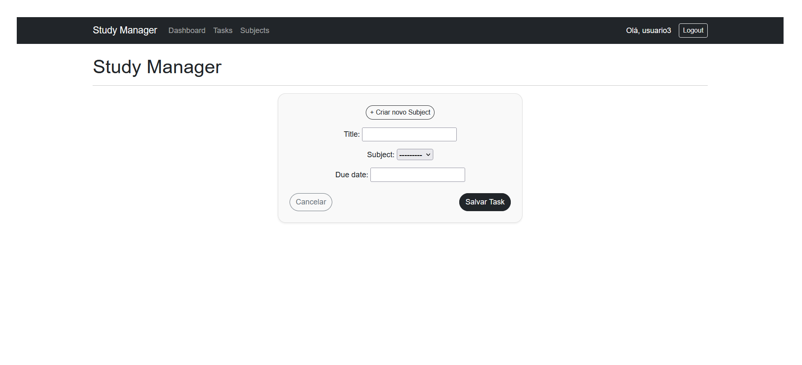
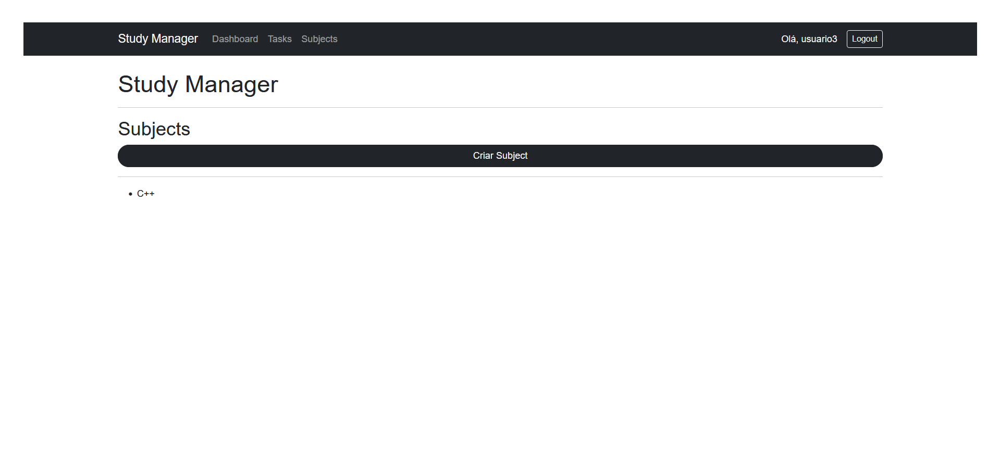
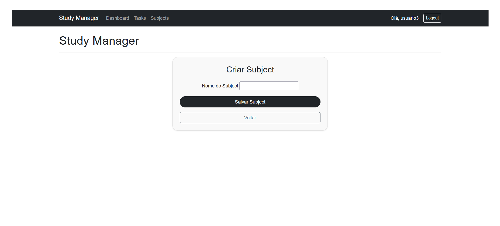

# 📚 Study Manager

Study Manager é uma aplicação web desenvolvida com **Django** para ajudar estudantes a organizarem suas tarefas de estudo de forma simples e eficiente.

O sistema permite criar **matérias**, adicionar **tarefas relacionadas**, acompanhar **progresso de estudos** e visualizar métricas através de um **dashboard de produtividade**.

---

# 🌐 Live Demo

A aplicação está disponível online:

🔗 https://study-manager.onrender.com

Você pode criar uma conta e testar todas as funcionalidades do sistema diretamente no navegador.

---

# 📸 Screenshots

> 📌 Uma pequena demonstração visual `/screenshots`

## Homepage

## Dashboard

## Lista de Tasks

## Criar Task

## Lista de Subjects

## Criar Subjects

---

# 🚀 Features

### User Authentication

* Cadastro de usuários
* Login e autenticação
* Isolamento de dados por usuário

---

### Subjects (Matérias)

* Criar matérias
* Editar matérias
* Remover matérias

---

### Task Management

* Criar tarefas
* Editar tarefas
* Deletar tarefas
* Marcar tarefa como concluída
* Marcar tarefa como pendente

---

### Smart Task System

* Detecção automática de tarefas atrasadas
* Filtro de tarefas por status:

  * Completed
  * Pending
  * Late
* Filtro por matéria (subject)

---

### Dashboard

O dashboard apresenta métricas importantes para acompanhamento dos estudos:

* Total de tarefas
* Tarefas concluídas
* Tarefas pendentes
* Tarefas atrasadas
* Progresso geral de estudos (%)

---

# 🧠 Tech Stack

### Backend

* Python
* Django

### Frontend

* HTML
* CSS
* Bootstrap

### Database

* SQLite

---

# 🏗 Project Structure

study_manager/

core/
 models.py

tasks/
 models.py
 views.py
 forms.py
 urls.py

subjects/
 models.py
 views.py
 urls.py

templates/

screenshots/  ← 📸 screenshots usados no README

manage.py
db.sqlite3

---

# 🗄 Data Model

Relação entre entidades:

User
└── Subjects
  └── Tasks

### Subject

Representa uma matéria de estudo.

Campos principais:

* name
* description
* user
* created_at
* updated_at

---

### Task

Representa uma tarefa vinculada a uma matéria.

Campos principais:

* title
* description
* due_date
* completed
* subject
* user

---

# 🔒 Security

Cada usuário só pode acessar **suas próprias tasks e subjects**.

Isso é garantido através de filtros nas consultas:

Task.objects.filter(user=self.request.user)

Além disso, os formulários filtram automaticamente os subjects disponíveis para o usuário atual.

---

# ▶ Running Locally (Optional)

Caso queira rodar o projeto localmente:

Clone o repositório

git clone https://github.com/8JotaScript8/study-manager.git

Entre na pasta do projeto

cd study-manager

Crie um ambiente virtual

python -m venv venv

Ative o ambiente (Windows)

venv\Scripts\activate

Instale as dependências

pip install django

Aplique as migrações

python manage.py migrate

Execute o servidor

python manage.py runserver

Acesse no navegador

http://127.0.0.1:8000

---

# 🔮 Future Improvements

Possíveis evoluções do projeto:

* API REST com Django REST Framework
* Sistema de prioridade de tarefas
* Sistema de tags
* Notificações de tarefas próximas do prazo
* Deploy com Docker
* Banco de dados PostgreSQL
* Paginação de tarefas

---

# 👨‍💻 Author

João Bazilio

Estudante de Análise e Desenvolvimento de Sistemas com foco em desenvolvimento backend.

